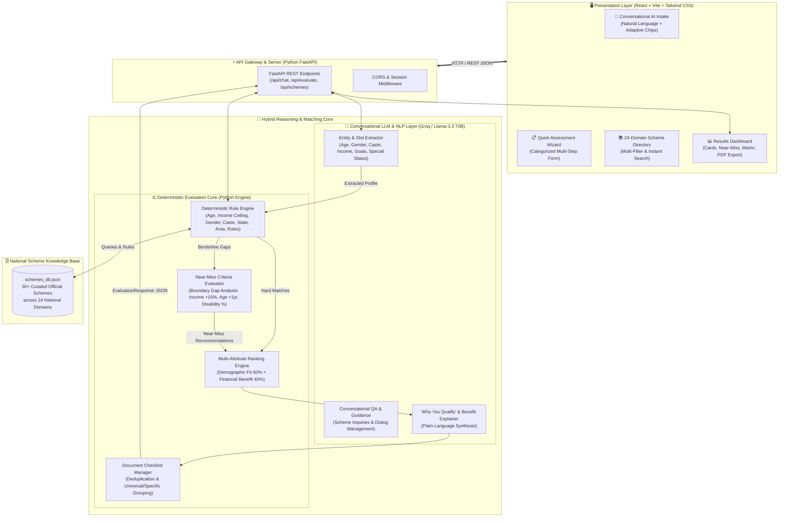
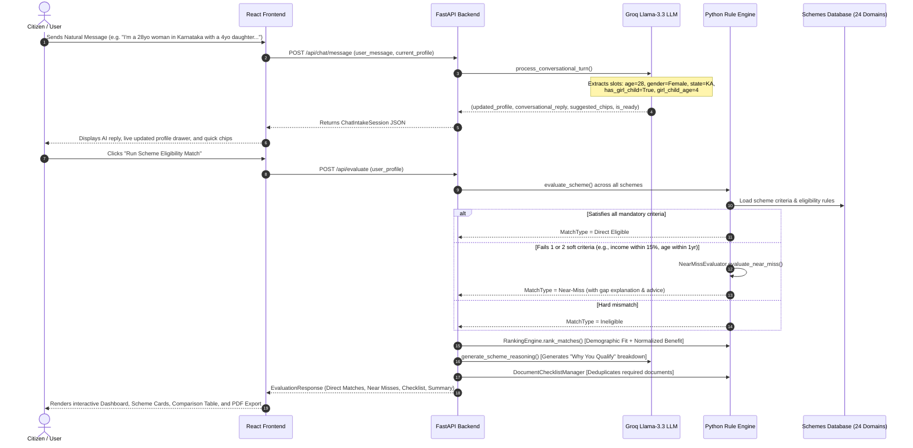

# 🏛️ System Architecture: GovScheme.AI

**GovScheme.AI** is an enterprise-grade, hybrid **RAG & Rule-Powered National Scheme Eligibility & Benefit Matching Engine** designed to help Indian citizens discover, evaluate, and apply for central and state government welfare schemes, subsidies, grants, loans, and scholarships across **24 National Domains**.

---

## 📐 1. End-to-End System Architecture



---

## 🔄 2. Data Flow & Execution Sequence



---

## 🧩 3. Architectural Component Breakdown

### A. Presentation Layer (Frontend)
- **Framework:** React 19 + Vite + Tailwind CSS + Lucide Icons + jsPDF
- **Core Components:**
  1. `ChatIntake.jsx`: Natural language conversational intake with dynamic suggested chip replies.
  2. `QuickFormIntake.jsx`: Multi-step categorized assessment wizard (Demographics, Economics, Specialized Criteria).
  3. `ProfileSummaryDrawer.jsx`: Live reactive profile viewer displaying extracted attributes.
  4. `SchemeCard.jsx`: Displays match score, domain badges, "Why You Qualify" accordion, Near-Miss alert notices, and official portal links.
  5. `DocumentChecklist.jsx`: Deduplicated document checklist with real-time checkbox tracking and 1-click PDF download.
  6. `SchemeComparison.jsx`: Side-by-side comparison table of benefits, subsidies, and requirements.
  7. `SchemeCatalog.jsx`: 24-domain chips filter with instant search.

### B. API Gateway & Controllers (Backend)
- **Framework:** Python 3.9+ with FastAPI & Uvicorn
- **Endpoints:**
  - `POST /api/chat/start`: Initializes intake session and profile state.
  - `POST /api/chat/message`: Handles natural language input, slot extraction, and dynamic quick replies.
  - `POST /api/evaluate`: Executes deterministic rule matching, ranking, and document aggregation.
  - `GET /api/schemes`: Returns all schemes across the 24 domains.
  - `POST /api/config/groq-key`: Runtime API key management.

### C. Hybrid Reasoning Core
- **1. Natural Language Slot Extractor & Conversational Agent (`llm_explainer.py`):**
  - Uses **Groq API (`llama-3.3-70b-versatile`)** to extract unstructured demographic details into structured attributes.
  - Includes a regex/pattern-based NLP fallback engine for 100% uptime and offline reliability.
- **2. Deterministic Rule Engine (`rule_engine.py`):**
  - Strictly checks legal criteria (Age limits, Income ceilings, Gender prerequisites, Caste categories, State/Region, Rural/Urban area, Benchmark disability %, Maternity, Girl child age, Greenfield project status, Non-taxpayer condition).
- **3. Near-Miss Engine (`near_miss.py`):**
  - Identifies boundary candidates failing 1 or 2 soft criteria and computes exact quantitative gaps with actionable advice.
- **4. Ranking Engine (`ranking.py`):**
  - Scores recommendations: $\text{Rank Score} = (\text{Match Score} \times 0.6) + (\text{Log-Scaled Financial Benefit} \times 0.4)$.
- **5. Document Checklist Aggregator (`document_checklist.py`):**
  - Separates universal identity proofs (Aadhaar, PAN, Bank Passbook, Photos) from scheme-specific proofs (DPR, RoR Land extract, Caste/UDID certificates).

---

## 🏛️ 4. Decoupled 24-Domain Schema Matrix

```
Citizen Profile Attributes             Standardized Scheme Domains (24)
──────────────────────────             ────────────────────────────────
• Age, Gender, Social Category   ───►  1. Education & Scholarships
• Annual Household Income        ───►  2. Health & Medical (PM-JAY, PMMVY)
• State / District / Rural-Urban ───►  3. Housing & Shelter (PMAY)
• Primary Occupation             ───►  4. Banking & Insurance (PMSBY, PMJJBY, APY)
• Benchmark Disability (UDID %)  ───►  5. Women & Child Welfare (Sukanya Samriddhi)
• Maternity / Pregnancy Status   ───►  6. Agriculture & Allied (PM-KISAN, PMFBY)
• Girl Child (& Age)             ───►  7. MSME & Entrepreneurship (PMEGP, MUDRA)
• Available Rooftop Solar Space  ───►  8. Employment & Skill Development (PMKVY)
• BPL / Antyodaya Ration Card    ───►  9. Disability & Accessibility (ADIP Scheme)
• e-Shram / Unorganised Worker   ───►  10. Senior Citizens & Pensions (IGNOAPS)
• Greenfield / New Venture       ───►  11. Social Justice & Empowerment
• Landholding Size (Acres)       ───►  12-24. Environment, Rural/Urban, Handloom, etc.
```

---

## 🛡️ 5. Non-Functional & Quality Attributes

| Attribute | Implementation Strategy |
| :--- | :--- |
| **Determinism & Trust** | Financial eligibility and legal caps are computed by mathematical Python rules, avoiding LLM hallucinations. |
| **Explainability** | Every matched scheme displays a transparent point-by-point breakdown of which citizen attributes matched the scheme rules. |
| **Resilience & Fallback** | The platform functions completely even if offline or if no LLM API key is present via deterministic fallback reasoning. |
| **Extensibility** | Adding new government schemes requires simply adding a JSON entry to `schemes_db.json` without frontend code changes. |
| **Exportability** | 1-Click client-side PDF document checklist generation and Markdown export for offline use. |
